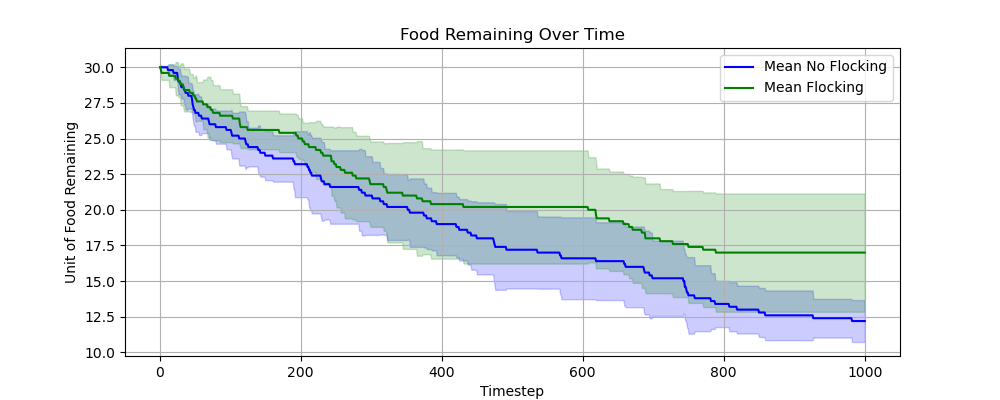
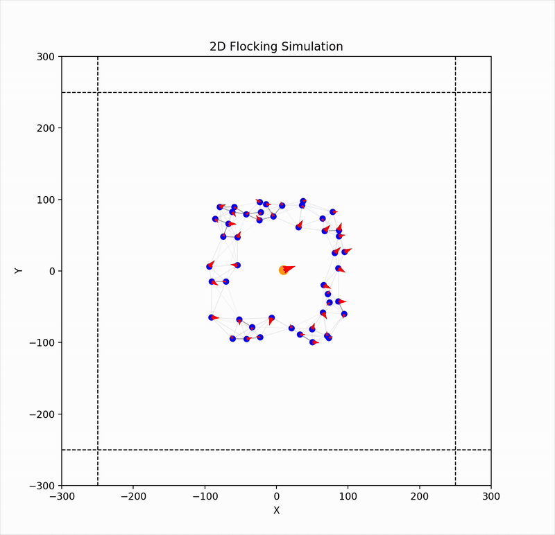
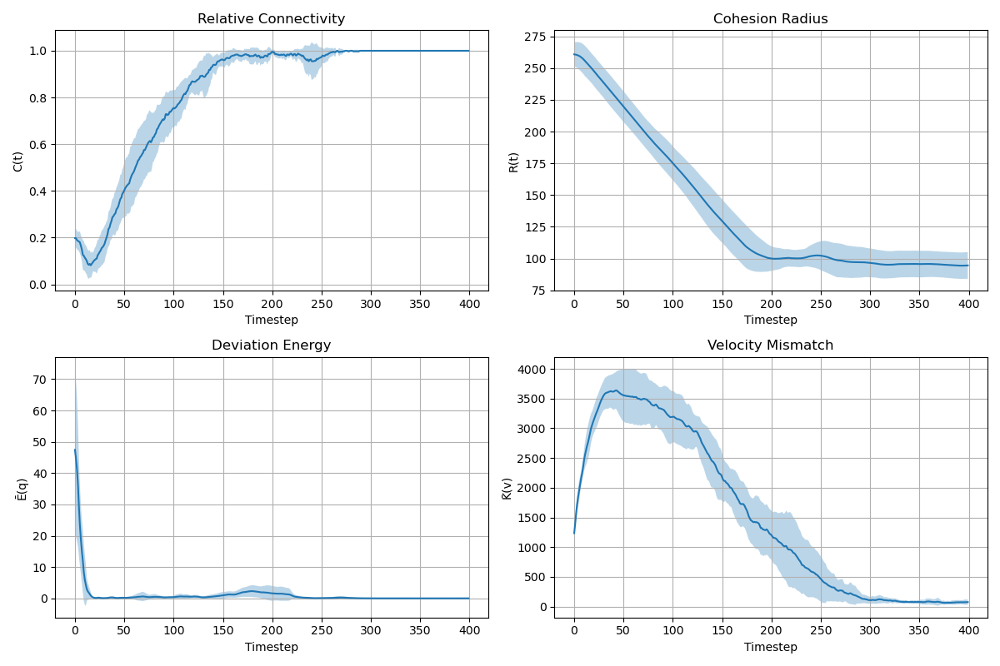
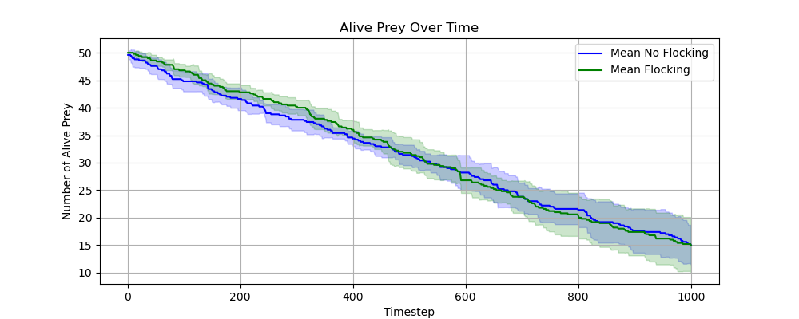
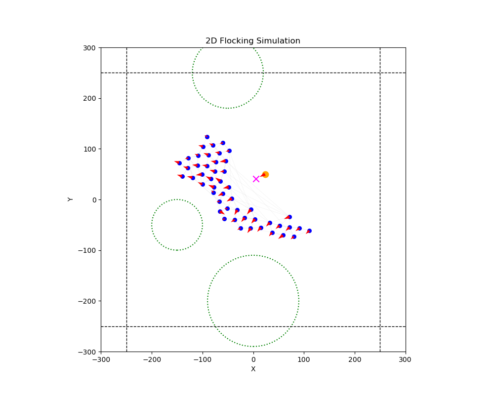

# 🐦 Flocking Simulation 🐦

Best extendable simulator. Easy to work off of. Great place to start.



> **Explore the fascinating world of emergent collective behavior with this comprehensive flocking simulation framework based on the groundbreaking algorithms by Olfati-Saber and Craig.**

[](https://www.python.org/)
[](https://numpy.org/)
[](https://matplotlib.org/)
[](https://www.seas.upenn.edu/)

## 🎬 Watch It In Action

### 2D Flocking Simulation with 100 Agents


### 3D Flocking Simulation


## 🌟 Overview
This project implements various flocking algorithms and simulations in both 2D and 3D environments. It is based on the theoretical frameworks of Olfati-Saber and Craig's flocking models, with implementations for different scenarios including basic flocking, obstacle avoidance, foraging, and predator-prey dynamics.

### ✨ Key Highlights
- **Biologically Inspired** algorithms that mimic natural bird flocking, fish schooling, and insect swarming
- **Real-time visualizations** of emergent collective behaviors
- **Advanced metrics** for quantifying group coherence and coordination
- **Multiple interaction models** including attraction-repulsion dynamics and velocity alignment

## 📂 Project Structure
- **Olfati-Saber 2D/**: Implementation of the Olfati-Saber flocking algorithm in 2D
  - `Node2D.py`: Defines node/agent behavior in the Olfati-Saber model
  - `Edge2D.py`: Defines edges between nodes
  - `Graph2D.py`: Implements the graph structure for node interactions
  - `Obstacle2D.py`: Defines obstacle implementation
  - `run2D.py`: Basic flocking simulation
  - `run2D_forage.py`: Foraging behavior simulation
  - `run2D_predator.py`: Predator-prey dynamics simulation
  - `run2D_obstacle.py`: Simulation with obstacle avoidance

- **Craig 2D/**: Implementation of Craig's flocking algorithm in 2D
  - `Node2D.py`: Defines node/agent behavior in Craig's model
  - `Edge2D.py`: Defines edges between nodes
  - `Graph2D.py`: Implements the graph structure for node interactions
  - `run2D.py`: Basic simulation

- **3D/**: 3D implementation of flocking algorithms
  - `Node3D.py`: Defines node behavior in 3D
  - `Edge3D.py`: Defines edges between nodes
  - `Graph3D.py`: Implements the graph structure for 3D node interactions
  - `run3D.py`: 3D simulation

- **vis.py**: Visualization tool for understanding agent interaction functions

## 🚀 Features
- Dynamic flocking behavior simulation
- Obstacle avoidance capabilities
- Foraging behavior with food sources
- Predator-prey dynamics
- Multiple metrics to evaluate flocking performance:
  - Relative connectivity
  - Cohesion radius
  - Normalized deviation energy
  - Velocity mismatch

## 🎬 More Simulations

### Foraging Behavior Simulation


### Predator-Prey Dynamics


### Obstacle Avoidance


## 🎮 How to Run

### Basic Flocking Simulation
```bash
cd "Olfati-Saber 2D"
python run2D.py
```

### Foraging Simulation
```bash
cd "Olfati-Saber 2D"
python run2D_forage.py
```

### Predator-Prey Simulation
```bash
cd "Olfati-Saber 2D"
python run2D_predator.py
```

### 3D Simulation
```bash
cd "3D"
python run3D.py
```

### Visualization Tool
```bash
python vis.py
```

## ⚙️ Parameters
The simulations include various adjustable parameters:
- Number of agents
- Interaction range
- Desired inter-agent spacing
- Attraction and repulsion coefficients
- Environment boundaries
- Obstacle configurations

## 📚 Theoretical Background
This project is based on several research papers on flocking algorithms, which can be found in the `papers/` directory:
- "Flocking for Multi-Agent Dynamic Systems: Algorithms and Theory" by Olfati-Saber
- Other papers on flocking behavior, optimization-based distributed flocking, and predator-prey dynamics



## 📊 Results
The simulation generates various metrics and visualizations:
- Real-time visualization of flocking behavior
- Convergence plots showing how the flock stabilizes over time
- Food foraging efficiency comparison between flocking and non-flocking agents
- Predator-prey interaction dynamics



### Parameter Visualization Tool


## 💻 Requirements
- Python 3.x
- NumPy
- Matplotlib

## 📄 License
This project was developed for MEAM 6240 at the University of Pennsylvania.

---

**Keywords**: flocking simulation, multi-agent systems, swarm intelligence, collective behavior, Olfati-Saber algorithm, emergent behavior, agent-based modeling, computational biology, artificial life, Python simulation, predator-prey dynamics, foraging simulation 